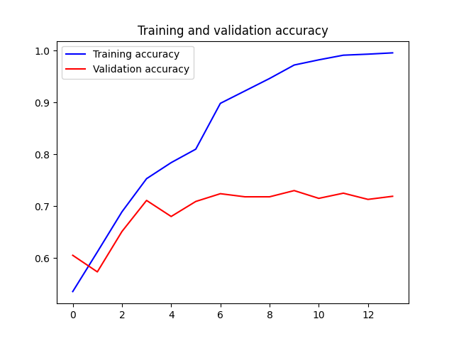
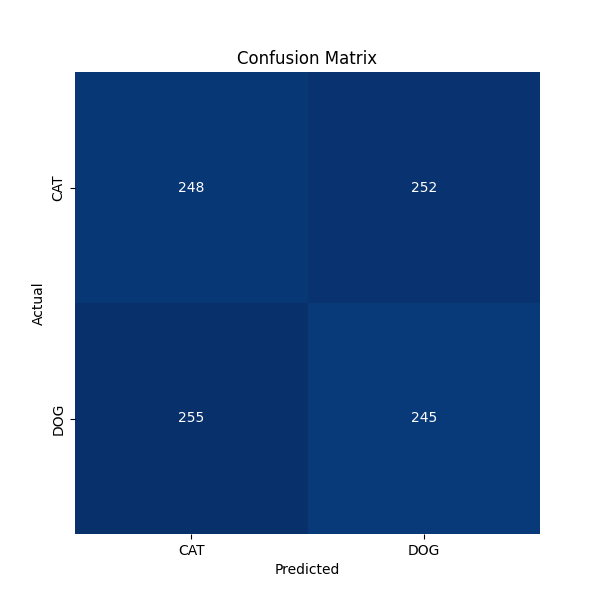
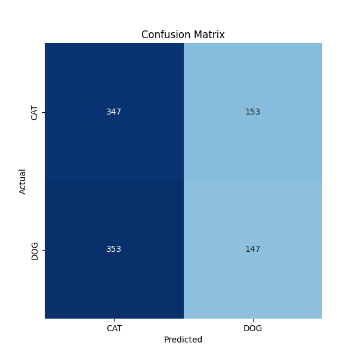

# Learn Machine to differentiate dog and cat

# Explicação (pt-br)

A escolha do problema, foi decorrente de uma estratégia para simplificar o meu aprendizado sobre a aplicação de modelos
de aprendizagem, com o objetivo de chegar a um problema com uma complexidade maior (identificar o uso de EPI). E por 
isso, foi decidido experimentar o aprendizado de máquina com um problema parecido e de complexidade menor. Então o objetivo
deste trabalho é construir um modelo de rede neural capaz de diferenciar cachorro e gato.

O dataset escolhi para a aprendizagem foi o [Cats_Vs_Dogs](https://storage.googleapis.com/mledu-datasets/cats_and_dogs_filtered.zip).
Esse dataset é dividido em uma coleção de 2000 imagens para treino e 1000 imagens para validação.

Para o pré-processamento dos dados, foi utilizada a biblioteca Keras para carregar e redimensionar as imagens. 
Para determinar o melhor parâmetro para o redimensionamento das imagens foi feita uma análise estatística básica no 
conjunto de dados de imagens.
No pré-processamento também é aplicada a técnica de normalização dos dados, dividindo os valores da intensidade dos 
pixels por 255, para que o valor fique entre 0 e 1.

Também é aplicada a técnica de aumento de dados (data augmentation) para melhorar a capacidade do modelo generalisar 
padrões. Para aplicar a técnica de aumento de dados, são passados alguns parâmetros para definir valores de rotação, 
deslocamento horizontal e vertical, cisalhamento, zoom e espelhamento horizontal.

O projeto utiliza diferentes arquiteturas de redes neurais, como MLP e CNN, e variações dessas arquiteturas, 
como CNN2 (no qual utiliza camadas de normalização em lote) e CNN2_DP (no qual aplica técnica de dropout). 
Os modelos que aplicam variações arquiteturais de CNN possuem a camada de classificação similar ao modelo que aplica
arquitetura MLP. E as arquiteturas Convolucionais variam extendendo o modelo mais simples (CNN), aplicando novas camadas.
Logo será apresentado com detalhes a arquitetura mais completa (CNN2_DP).

* Camadas Convolucionais:
  * Primeira camada convolucional: Possui 16 filtros com tamanho de kernel 3x3, utilizando a função de ativação ReLU. Camadas convolucionais iniciais com um número menor de filtros (como 16) são responsáveis por capturar características mais simples, como bordas ou texturas básicas. À medida que avançamos nas camadas convolucionais, o número de filtros aumenta, permitindo a extração de características mais complexas e abstratas.
  * Camadas de Batch Normalization: Aplicadas após cada camada convolucional, visam normalizar as ativações dos neurônios, acelerando o treinamento e tornando a rede mais robusta.
  * Camadas de Max Pooling: Aplicadas após cada camada convolucional, têm o objetivo de reduzir a dimensionalidade das características extraídas, mantendo as informações mais relevantes. Utiliza uma janela de pooling com tamanho 2x2.
* Camadas de Dropout: Aplicadas após cada camada de Max Pooling, com um valor de 0.25. O Dropout desativa aleatoriamente um percentual de neurônios durante o treinamento, o que reduz o overfitting, aumenta a capacidade de generalização e melhora a robustez do modelo.
* Camada Flatten: A camada Flatten é responsável por transformar o tensor de saída das camadas convolucionais em um vetor unidimensional, preparando-o para ser alimentado nas camadas densas subsequentes.
* Camadas Densas:
  * Primeira camada densa: Possui 512 unidades (neurônios) com a função de ativação ReLU. Essa camada tem o objetivo de aprender representações mais complexas e abstratas das características extraídas pelas camadas convolucionais.
  * Camada de Batch Normalization: Aplicada após a primeira camada densa para normalizar as ativações dos neurônios.
  * Camada de Dropout: Aplicada após a camada de Batch Normalization com um valor de 0.5 para regularização.
* Camada de Saída:
  * Última camada densa: Possui uma única unidade de saída com a função de ativação sigmoidal. Essa camada produz um valor entre 0 e 1, representando a probabilidade de uma imagem pertencer à classe-alvo.

O projeto realiza a validação dos resultados usando a matriz de confusão e o relatório de classificação
(classification report). As principais métricas analisadas no resultado são a acurácia e o f1-score.
Pois, como o objetivo da aprendizagem não é minimizar o erro de classificação espécifico para alguma classe,
e sim a capacidade de acertar a classe correta. Não foi aplicada a técnica de validação cruzada (cross-validation),
entretanto é possível que essa técnica avalie o desempenho de um modelo de aprendizado de máquina de forma mais robusta.


## Preparing data

For this experiment, the dataset "cats_and_dogs" from
`https://storage.googleapis.com/mledu-datasets/cats_and_dogs_filtered.zip` was used.
This dataset is stored as a cache at the root of the project directory.

This dataset is already divided into a training and validation set. The training set has 2000 images of dogs and cats,
divided in half. The validation set has 1000 images of dogs and cats, divided in half.

## Build Models

### MLP

```
model_mlp = keras.Sequential([
    keras.layers.Flatten(input_shape=(img_size, img_size, 3)),
    keras.layers.Dense(512, activation='relu'),
    keras.layers.Dense(1, activation='sigmoid')
])
```

### CNN

```
model_cnn = keras.Sequential([
    keras.layers.Conv2D(16, (3, 3), activation='relu', input_shape=(img_size, img_size, 3)),
    keras.layers.MaxPool2D((2, 2)),

    keras.layers.Conv2D(32, (3, 3), activation='relu'),
    keras.layers.MaxPool2D((2, 2)),

    keras.layers.Conv2D(64, (3, 3), activation='relu'),
    keras.layers.MaxPool2D((2, 2)),

    keras.layers.Flatten(),
    keras.layers.Dense(512, activation='relu'),
    keras.layers.Dense(1, activation='sigmoid')
])
```

### CNN2

```
model_cnn2 = keras.Sequential([
    keras.layers.Conv2D(16, (3, 3), activation='relu', input_shape=(img_size, img_size, 3)),
    keras.layers.BatchNormalization(),
    keras.layers.MaxPool2D((2, 2)),

    keras.layers.Conv2D(32, (3, 3), activation='relu'),
    keras.layers.BatchNormalization(),
    keras.layers.MaxPool2D((2, 2)),

    keras.layers.Conv2D(64, (3, 3), activation='relu'),
    keras.layers.BatchNormalization(),
    keras.layers.MaxPool2D((2, 2)),

    keras.layers.Flatten(),
    keras.layers.Dense(512, activation='relu'),
    keras.layers.BatchNormalization(),
    keras.layers.Dense(1, activation='sigmoid')
])
```

### Training history

| Model          |           Accuracy           |             Loss              |
|----------------|:----------------------------:|:-----------------------------:|
| MLP            |      |      |
| CNN            |      |      |
| CNN2           |     |     |
| CNN2 (DROPOUT) |  |  |

### Results

#### MLP
```
Test Accuracy: 0.5820000171661377
Test Loss: 0.74488365650177
```


```
              precision    recall  f1-score   support

         CAT       0.50      0.63      0.55       500
         DOG       0.49      0.36      0.41       500

    accuracy                           0.49      1000
   macro avg       0.49      0.49      0.48      1000
weighted avg       0.49      0.49      0.48      1000
```

#### CNN
```
Test Accuracy: 0.718999981880188
Test Loss: 1.1275080442428589
```



```
              precision    recall  f1-score   support

         CAT       0.49      0.50      0.49       500
         DOG       0.49      0.49      0.49       500

    accuracy                           0.49      1000
   macro avg       0.49      0.49      0.49      1000
weighted avg       0.49      0.49      0.49      1000
```

#### CNN2
```
Test Accuracy: 0.7120000123977661
Test Loss: 1.5042719841003418
```


```
              precision    recall  f1-score   support

         CAT       0.52      0.53      0.53       500
         DOG       0.52      0.52      0.52       500

    accuracy                           0.52      1000
   macro avg       0.52      0.52      0.52      1000
weighted avg       0.52      0.52      0.52      1000
```

#### CNN2 with Dropout
```
Test Accuracy: 0.7490000128746033
Test Loss: 0.7401270866394043
```


```
              precision    recall  f1-score   support

         CAT       0.51      0.63      0.56       500
         DOG       0.51      0.39      0.44       500

    accuracy                           0.51      1000
   macro avg       0.51      0.51      0.50      1000
weighted avg       0.51      0.51      0.50      1000
```

## Data Augmentation

To generate the images iterator for model fit, function `ImageDataGenerator` from library
`keras.preprocessing.image` is used.

This function is called, passing some parameters to data augmentation as:

```
    rotation_range=40
    width_shift_range=0.2
    height_shift_range=0.2
    shear_range=0.2
    zoom_range=0.2
    horizontal_flip=True
    fill_mode='nearest'
```

### Training history with Data Augmentation

| Model          |               Accuracy               |                 Loss                  | 
|----------------|:------------------------------------:|:-------------------------------------:|
| MLP            |      |      |
| CNN            |      |      |
| CNN2           |     |     |
| CNN2 (DROPOUT) |  |  |

### Results

## MLP-DATAAUG

```
Test Accuracy: 0.6000000238418579
Test Loss: 0.6639021635055542
```


```
              precision    recall  f1-score   support

         CAT       0.48      0.54      0.51       500
         DOG       0.48      0.42      0.45       500

    accuracy                           0.48      1000
   macro avg       0.48      0.48      0.48      1000
weighted avg       0.48      0.48      0.48      1000
```

## CNN-DATAAUG

```
Test Accuracy: 0.7540000081062317
Test Loss: 0.4956442713737488
```


```
              precision    recall  f1-score   support

         CAT       0.49      0.46      0.48       500
         DOG       0.49      0.52      0.51       500

    accuracy                           0.49      1000
   macro avg       0.49      0.49      0.49      1000
weighted avg       0.49      0.49      0.49      1000
```
## CNN2-DATAAUG

```
Test Accuracy: 0.7559999823570251
Test Loss: 0.49308863282203674
```


```
              precision    recall  f1-score   support

         CAT       0.48      0.48      0.48       500
         DOG       0.48      0.48      0.48       500

    accuracy                           0.48      1000
   macro avg       0.48      0.48      0.48      1000
weighted avg       0.48      0.48      0.48      1000
```

## CNN2_DP-DATAAUG

```
Test Accuracy: 0.6779999732971191
Test Loss: 0.62696772813797
```



```
              precision    recall  f1-score   support

         CAT       0.50      0.69      0.58       500
         DOG       0.49      0.29      0.37       500

    accuracy                           0.49      1000
   macro avg       0.49      0.49      0.47      1000
weighted avg       0.49      0.49      0.47      1000
```
