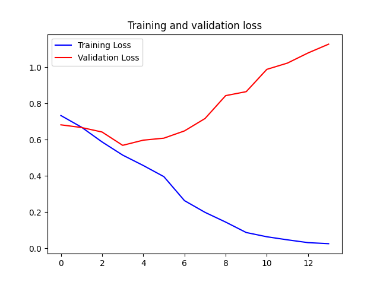

# Learn Machine to differentiate dog and cat

## Preparing data

For this experiment, the dataset "cats_and_dogs" from
`https://storage.googleapis.com/mledu-datasets/cats_and_dogs_filtered.zip` was used.
This dataset is stored as a cache at the root of the project directory.

This dataset is already divided into a training and validation set. The training set has 2000 images of dogs and cats,
divided in half. The validation set has 1000 images of dogs and cats, divided in half.

## Build Models

### MLP

```
model_mlp = keras.Sequential([
    keras.layers.Flatten(input_shape=(img_size, img_size, 3)),
    keras.layers.Dense(512, activation='relu'),
    keras.layers.Dense(1, activation='sigmoid')
])
```

### CNN

```
model_cnn = keras.Sequential([
    keras.layers.Conv2D(16, (3, 3), activation='relu', input_shape=(img_size, img_size, 3)),
    keras.layers.MaxPool2D((2, 2)),

    keras.layers.Conv2D(32, (3, 3), activation='relu'),
    keras.layers.MaxPool2D((2, 2)),

    keras.layers.Conv2D(64, (3, 3), activation='relu'),
    keras.layers.MaxPool2D((2, 2)),

    keras.layers.Flatten(),
    keras.layers.Dense(512, activation='relu'),
    keras.layers.Dense(1, activation='sigmoid')
])
```

### CNN2

```
model_cnn2 = keras.Sequential([
    keras.layers.Conv2D(16, (3, 3), activation='relu', input_shape=(img_size, img_size, 3)),
    keras.layers.BatchNormalization(),
    keras.layers.MaxPool2D((2, 2)),

    keras.layers.Conv2D(32, (3, 3), activation='relu'),
    keras.layers.BatchNormalization(),
    keras.layers.MaxPool2D((2, 2)),

    keras.layers.Conv2D(64, (3, 3), activation='relu'),
    keras.layers.BatchNormalization(),
    keras.layers.MaxPool2D((2, 2)),

    keras.layers.Flatten(),
    keras.layers.Dense(512, activation='relu'),
    keras.layers.BatchNormalization(),
    keras.layers.Dense(1, activation='sigmoid')
])
```

### Training history

| Model          |           Accuracy           |             Loss              |
|----------------|:----------------------------:|:-----------------------------:|
| MLP            |      |      |
| CNN            |      |      |
| CNN2           |     |     |
| CNN2 (DROPOUT) |  |  |

### Results

#### MLP
```
Test Accuracy: 0.5820000171661377
Test Loss: 0.74488365650177
```


```
              precision    recall  f1-score   support

         CAT       0.50      0.63      0.55       500
         DOG       0.49      0.36      0.41       500

    accuracy                           0.49      1000
   macro avg       0.49      0.49      0.48      1000
weighted avg       0.49      0.49      0.48      1000
```

#### CNN
```
Test Accuracy: 0.718999981880188
Test Loss: 1.1275080442428589
```


```
              precision    recall  f1-score   support

         CAT       0.49      0.50      0.49       500
         DOG       0.49      0.49      0.49       500

    accuracy                           0.49      1000
   macro avg       0.49      0.49      0.49      1000
weighted avg       0.49      0.49      0.49      1000
```

#### CNN2
```
Test Accuracy: 0.7120000123977661
Test Loss: 1.5042719841003418
```


```
              precision    recall  f1-score   support

         CAT       0.52      0.53      0.53       500
         DOG       0.52      0.52      0.52       500

    accuracy                           0.52      1000
   macro avg       0.52      0.52      0.52      1000
weighted avg       0.52      0.52      0.52      1000
```

#### CNN2 with Dropout
```
Test Accuracy: 0.7490000128746033
Test Loss: 0.7401270866394043
```


```
              precision    recall  f1-score   support

         CAT       0.51      0.63      0.56       500
         DOG       0.51      0.39      0.44       500

    accuracy                           0.51      1000
   macro avg       0.51      0.51      0.50      1000
weighted avg       0.51      0.51      0.50      1000
```

## Data Augmentation

To generate the images iterator for model fit, function `ImageDataGenerator` from library
`keras.preprocessing.image` is used.

This function is called, passing some parameters to data augmentation as:

```
    rotation_range=40
    width_shift_range=0.2
    height_shift_range=0.2
    shear_range=0.2
    zoom_range=0.2
    horizontal_flip=True
    fill_mode='nearest'
```

### Training history with Data Augmentation

| Model          |               Accuracy               |                 Loss                  | 
|----------------|:------------------------------------:|:-------------------------------------:|
| MLP            |      |      |
| CNN            |      |      |
| CNN2           |     |     |
| CNN2 (DROPOUT) |  |  |

### Results

## MLP-DATAAUG

```
Test Accuracy: 0.6000000238418579
Test Loss: 0.6639021635055542
```


```
              precision    recall  f1-score   support

         CAT       0.48      0.54      0.51       500
         DOG       0.48      0.42      0.45       500

    accuracy                           0.48      1000
   macro avg       0.48      0.48      0.48      1000
weighted avg       0.48      0.48      0.48      1000
```

## CNN-DATAAUG

```
Test Accuracy: 0.7540000081062317
Test Loss: 0.4956442713737488
```


```
              precision    recall  f1-score   support

         CAT       0.49      0.46      0.48       500
         DOG       0.49      0.52      0.51       500

    accuracy                           0.49      1000
   macro avg       0.49      0.49      0.49      1000
weighted avg       0.49      0.49      0.49      1000
```
## CNN2-DATAAUG

```
Test Accuracy: 0.7559999823570251
Test Loss: 0.49308863282203674
```


```
              precision    recall  f1-score   support

         CAT       0.48      0.48      0.48       500
         DOG       0.48      0.48      0.48       500

    accuracy                           0.48      1000
   macro avg       0.48      0.48      0.48      1000
weighted avg       0.48      0.48      0.48      1000
```

## CNN2_DP-DATAAUG

```
Test Accuracy: 0.6779999732971191
Test Loss: 0.62696772813797
```


```
              precision    recall  f1-score   support

         CAT       0.50      0.69      0.58       500
         DOG       0.49      0.29      0.37       500

    accuracy                           0.49      1000
   macro avg       0.49      0.49      0.47      1000
weighted avg       0.49      0.49      0.47      1000
```
