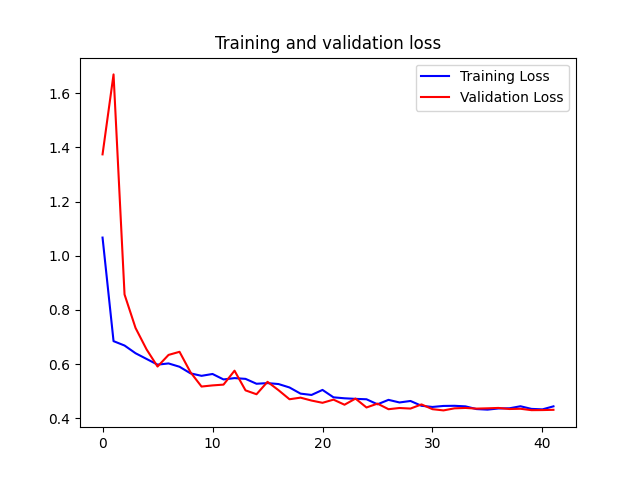

# Learn Machine to differentiate dog and cat

## Preparing data

For this experiment, the dataset "cats_and_dogs" from
`https://storage.googleapis.com/mledu-datasets/cats_and_dogs_filtered.zip` was used.
This dataset is stored as a cache at the root of the project directory.

This dataset is already divided into a training and validation set. The training set has 2000 images of dogs and cats,
divided in half. The validation set has 1000 images of dogs and cats, divided in half.

## Build Models

### MLP

```
model_mlp = keras.Sequential([
    keras.layers.Flatten(input_shape=(img_size, img_size, 3)),
    keras.layers.Dense(512, activation='relu'),
    keras.layers.Dense(1, activation='sigmoid')
])
```

### CNN

```
model_cnn = keras.Sequential([
    keras.layers.Conv2D(16, (3, 3), activation='relu', input_shape=(img_size, img_size, 3)),
    keras.layers.MaxPool2D((2, 2)),

    keras.layers.Conv2D(32, (3, 3), activation='relu'),
    keras.layers.MaxPool2D((2, 2)),

    keras.layers.Conv2D(64, (3, 3), activation='relu'),
    keras.layers.MaxPool2D((2, 2)),

    keras.layers.Flatten(),
    keras.layers.Dense(512, activation='relu'),
    keras.layers.Dense(1, activation='sigmoid')
])
```

### CNN2

```
model_cnn2 = keras.Sequential([
    keras.layers.Conv2D(16, (3, 3), activation='relu', input_shape=(img_size, img_size, 3)),
    keras.layers.BatchNormalization(),
    keras.layers.MaxPool2D((2, 2)),

    keras.layers.Conv2D(32, (3, 3), activation='relu'),
    keras.layers.BatchNormalization(),
    keras.layers.MaxPool2D((2, 2)),

    keras.layers.Conv2D(64, (3, 3), activation='relu'),
    keras.layers.BatchNormalization(),
    keras.layers.MaxPool2D((2, 2)),

    keras.layers.Flatten(),
    keras.layers.Dense(512, activation='relu'),
    keras.layers.BatchNormalization(),
    keras.layers.Dense(1, activation='sigmoid')
])
```

### Results

| Model |         Accuracy          |            Loss            |
|-------|:-------------------------:|:--------------------------:|
| MLP   |   |   |
| CNN   |   |   |
| CNN2  |  |  |

## Data Augmentation

To generate the images iterator for model fit, function `ImageDataGenerator` from library
`keras.preprocessing.image` is used.

This function is called, passing some parameters to data augmentation as:

```
    rotation_range=40
    width_shift_range=0.2
    height_shift_range=0.2
    shear_range=0.2
    zoom_range=0.2
    horizontal_flip=True
    fill_mode='nearest'
```

### Results with Data Augmentation

| Model          |               Accuracy               |                 Loss                  | 
|----------------|:------------------------------------:|:-------------------------------------:|
| MLP            |      |      |
| CNN            |      |      |
| CNN2           |     |     |
| CNN2 (DROPOUT) |  |  |
