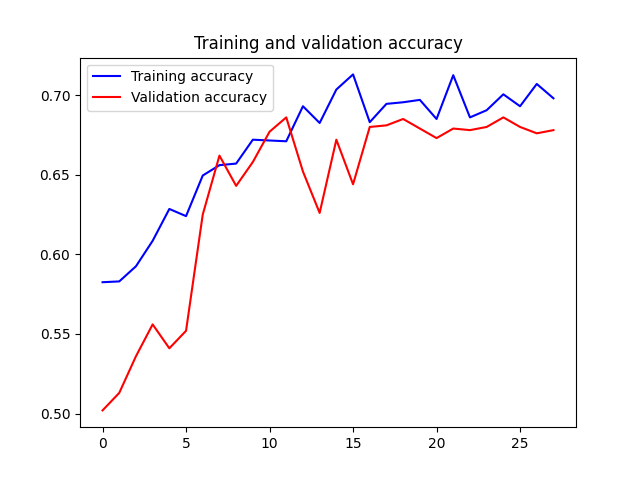

## CNN2_DP-DATAAUG

```
Test Accuracy: 0.6779999732971191
Test Loss: 0.62696772813797
```


```
              precision    recall  f1-score   support

         CAT       0.50      0.69      0.58       500
         DOG       0.49      0.29      0.37       500

    accuracy                           0.49      1000
   macro avg       0.49      0.49      0.47      1000
weighted avg       0.49      0.49      0.47      1000
```




