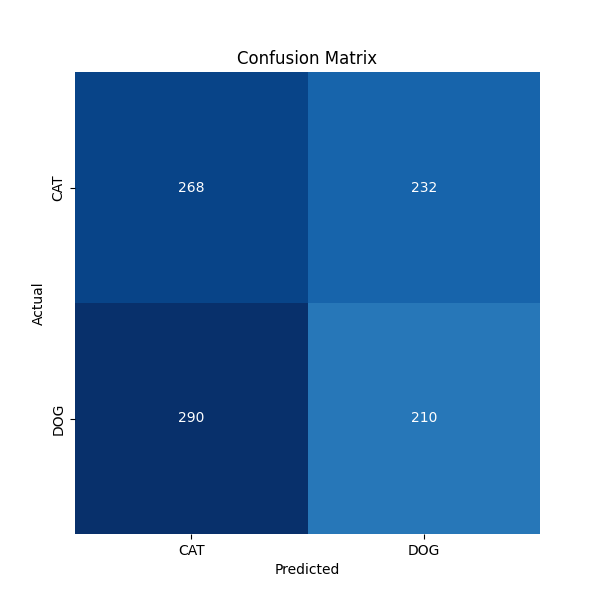

## MLP-DATAAUG

```
Test Accuracy: 0.6000000238418579
Test Loss: 0.6639021635055542
```



```
              precision    recall  f1-score   support

         CAT       0.48      0.54      0.51       500
         DOG       0.48      0.42      0.45       500

    accuracy                           0.48      1000
   macro avg       0.48      0.48      0.48      1000
weighted avg       0.48      0.48      0.48      1000
```


